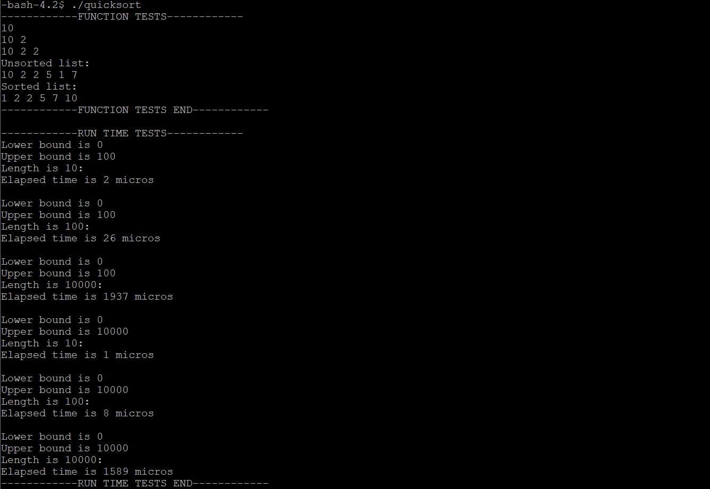

# Array-List
Here is the source code of sorting an array list using quick sort algorithm. Apart from the sorted result, the program prints out a "report" of how long it takes to run the implementation on a variety of array lengths. This C program is successfully compiled and run on a Linux system. Program output is also shown below.

## Files
* arraylist.h (Defined an array list and its function prototypes)
* quicksort.c (Implementation of functions, including quick sort)

## How to run

```
gcc quicksort.c -o quicksort
./quicksort
`````

## Output

